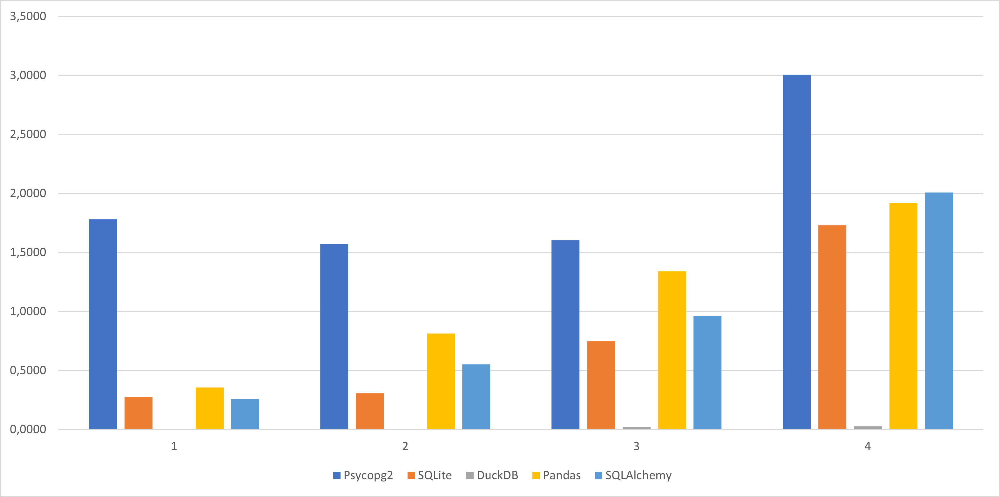

# Лабораторная работа Базы Данных
Я сравнил несколько библиотек для работы с базой данных между собой и вот график, который сравнивает время выполнения по 4 запросам (исходный датасет был не очень большой):


<!--Запросы-->
## Запросы:
Запрос 1:
Хоть этот запрос и выглядит лёгким, некоторые библиотеки тратят на него достаточно много времени (привет постгрес):

```SELECT VendorID, count(*) FROM t GROUP BY 1```

Запрос 2:
Этот запрос немного сильнее замедляет работу программы (кроме постгреса, он у нас индивид): 

```SELECT passenger_count, avg(total_amount) FROM t GROUP BY 1;```

Запрос 3:
Подобные запросы сложнее выполнять для баз данных. Зачастую у них может быть индекс для упрощения группировки по 1 столбцу, но по нескольким может потребоваться полное сканирование:

```SELECT passenger_count, strftime('%Y', tpep_pickup_datetime), count(*) FROM t GROUP BY 1, 2;```

Запрос 4:
Этот запрос совмещает все предыдущие сложности:

```SELECT passenger_count, strftime('%Y', tpep_pickup_datetime), round(trip_distance), count(*) FROM t GROUP BY 1, 2, 3 ORDER BY 2, 4 desc;```

<!--Мнение и сравнение-->
## Выводы

### Psycopg2
Худшая база данных, ненавижу.
Сначала морока разобраться как её запустить, потом она жрёт миллион места на диске (у меня 30 гигов съелось в один момент, оставив на диске 160 мб), так ещё и самая медленная... Зато есть онлайн просмотр и допступ не ограничивается одним компьютером...

### SQLite3
Уже предустановлена, удобна в использовании, достаточно быстрая (второе место по скорости), а так же удобно можно хранить в файле и просматривать его. Также можно хранить базу данных в оперативной памяти. SQLite не тратит впустую обработку и пропускную способность, распределяя запросы между процессом сервера приложений и процессом сервера базы данных. Он просто анализирует запросы, определяет, что делать (план запроса), вызывает fopen() в файле базы данных SQLite и выполняет запрос.

### DuckDB
Самая быстрая библиотека для работы с базой данных, можно работать как с файлом, так и ограничиваясь оперативной памятью. Единственная библиотека, которая смогла без проблем обработать большой датасет, к тому же почти не замедляясь в скорости. Легко и удобно читает csv файлы.
В нём заложено столбцово-векторизованное исполнение, которое делает эту современную базу данных быстрой.

### Pandas
Не очень сложная, используя sql запросы очень даже удобная. Имеет одно из самых лёгких чтений csv файлов, что можно даже сочетать с другими библиотеками. Но, можно сказать, так же является самой медленной библиотекой. Использует движок от SQLAlchemy, что позволяет использовать как в оперативной памяти, так и в файле.
Pandas, используя sql запросы не такой быстрый, как если бы его использовали через обращения к датафреймам, потому что он использует numpy под капотом, который в свою очередь реализует высокоэффективные операции с массивами.

### SQLAlchemy
Мне понравилось необычное использование, используя классы для таблиц. Неплох, если запросы не слишком сложные, иначе достаточно медленный. Используя движок, можно хранить как в файле, так и в оперативной памяти. Удобен, но медленный, плохо оптимизирует и кеширует однотипные данные.

### Выводы
DuckDB явлется самым простым и самым быстрым способом работы с базой данных. SQLAlchemy является довольно-таки интересной библиотекой, открывая интересные взаимодействия. Постгрес же даже упоминать не хочу. SQLite3 - удобен, привычен, популярен. Pandas - быстрый, если использовать через dataframes, но в таком случае становится достаточно сложным для понимания, через sql-запросы - достаточно медленный.